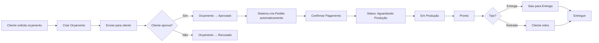

# Documentação de Negócio - Sistema de Gestão para Confeitaria

## 📋 Índice

1. [Visão Geral do Sistema](#visão-geral-do-sistema)
2. [Funcionalidades Principais](#funcionalidades-principais)
3. [Fluxos de Trabalho](#fluxos-de-trabalho)
4. [Casos de Uso](#casos-de-uso)

## 🎯 Visão Geral do Sistema

O **Sistema de Gestão para Confeitaria** é uma solução completa para gerenciar todos os aspectos de uma confeitaria, desde o primeiro contato com o cliente até a entrega final do produto.

### **Objetivos do Sistema:**

✅ Agilizar o processo de criação de orçamentos  
✅ Facilitar o controle de pedidos e produção  
✅ Organizar o estoque de insumos  
✅ Melhorar o controle financeiro  
✅ Centralizar informações de clientes  

---

## 🚀 Funcionalidades Principais

### **1. Dashboard**

**Objetivo:** Visão geral rápida do negócio

**Funcionalidades:**
- Visualização de pedidos do dia/semana
- Alertas de estoque baixo
- Resumo financeiro
- Atalhos rápidos para ações comuns

**Métricas Exibidas:**
- Pedidos pendentes
- Faturamento do mês
- Produtos mais vendidos
- Clientes recentes

---

### **2. Gestão de Produtos**

**Objetivo:** Cadastrar e gerenciar produtos oferecidos

**Funcionalidades:**
- ✅ Cadastro de bolos, adicionais e serviços
- ✅ Preço base + **preços diferentes por tamanho** (P/M/G)
- ✅ Categorização (Bolo, Adicional, Serviço)
- ✅ Upload de fotos
- ✅ Tempo de produção estimado
- ✅ Ativar/desativar produtos

**Fluxo:**
```
1. Acessar "Produtos"
2. Clicar em "Novo Produto"
3. Preencher dados (nome, categoria, preço)
4. Selecionar tamanhos e definir preços específicos
5. Salvar
```

---

### **3. Gestão de Clientes**

**Objetivo:** Manter cadastro completo de clientes

**Funcionalidades:**
- ✅ Cadastro com nome, telefone, e-mail
- ✅ CPF opcional
- ✅ Endereço completo com busca automática por CEP
- ✅ Observações personalizadas
- ✅ Histórico de pedidos (futuro)

**Benefícios:**
- Agiliza criação de orçamentos e pedidos
- Facilita contato para confirmações
- Permite marketing direcionado

---

### **4. Orçamentos**

**Objetivo:** Criar propostas para clientes e gerenciar aprovação

**Funcionalidades:**
- ✅ Criação guiada em 4 etapas
  1. Dados do cliente
  2. Seleção de itens (produtos + personalização)
  3. Decoração e observações
  4. Entrega e revisão
- ✅ Cálculo automático de valores
- ✅ **Múltiplos recheios** (até 3 por item)
- ✅ **Preço automático por tamanho**
- ✅ Status: Pendente → Enviado → Aprovado/Recusado
- ✅ **Conversão automática para Pedido** ao aprovar

**Fluxo de Aprovação:**
```
Pendente → [Botão "Enviar"] → Enviado → [Botão "Aprovar"] → Aprovado
                                                              ↓
                                                      Cria Pedido Automaticamente
```

---

### **5. Gestão de Pedidos**

**Objetivo:** Controlar produção e entrega

**Múltiplas Visualizações:**
- 📅 **Agenda Semanal:** Visão por dia da semana
- 📆 **Calendário Mensal:** Visão completa do mês
- 📋 **Lista:** Tabela detalhada de todos os pedidos
- 📊 **Kanban:** Fluxo visual por status

**Status do Pedido:**
1. **Pagamento Pendente** → Aguardando confirmação de pagamento
2. **Aguardando Produção** → Pago, mas ainda não iniciado
3. **Em Produção** → Sendo preparado
4. **Pronto** → Finalizado, aguardando entrega/retirada
5. **Saiu para Entrega** → Em rota de entrega
6. **Entregue** → Concluído

**Funcionalidades:**
- ✅ Confirmação rápida de pagamento (botão $)
- ✅ Drag-and-drop no Kanban para mudança de status
- ✅ Visualização detalhada com decoração, itens e entregas
- ✅ Prioridade (Normal/Urgente)

---

### **6. Planejamento de Produção**

**Objetivo:** Organizar produção e compras

**Funcionalidades:**
- ✅ Calendário de entregas
- ✅ **Resumo agregado de produção** por período
  - Quantidade total de cada massa
  - Quantidade total de cada recheio
  - Lista de pedidos do período
- ✅ **Exportação em PDF** do resumo
- ✅ Seleção de data inicial e final

**Benefícios:**
- Saber exatamente quanto comprar de cada ingrediente
- Organizar a ordem de produção
- Evitar desperdícios

**Exemplo de uso:**
```
1. Ir para "Produção"
2. Clicar em "Resumo"
3. Selecionar período (ex: 20/12 a 27/12)
4. Visualizar totais de massas e recheios
5. Clicar em "Exportar PDF" para imprimir lista de compras
```

---

### **7. Controle de Estoque**

**Objetivo:** Gerenciar insumos e evitar faltas

**Funcionalidades:**
- ✅ Cadastro de ingredientes, embalagens e decorações
- ✅ Controle de quantidade e unidade (kg, L, un)
- ✅ Estoque mínimo com alertas
- ✅ Histórico de compras
- ✅ Custo unitário para cálculo de lucratividade

**Alertas:**
- ⚠️ Vermelho: Abaixo do estoque mínimo
- 🟡 Amarelo: Próximo ao mínimo
- ✅ Verde: Estoque ok

---

### **8. Gestão Financeira**

**Objetivo:** Controlar entradas e saídas

**Funcionalidades:**
- ✅ Registro de todas as movimentações
- ✅ Categorização (Venda, Compra, Despesa)
- ✅ Fluxo de caixa mensal
- ✅ Relatórios por período
- ✅ Vinculação com pedidos

**Visões:**
- Fluxo de Caixa
- Relatórios mensais/anuais
- Gráficos de faturamento

---

## 🔄 Fluxos de Trabalho

### **Fluxo 1: Do Orçamento ao Pedido Entregue**



### **Fluxo 2: Planejamento Semanal de Produção**

```
1. Segunda-feira: Acessar "Produção" → Resumo
2. Selecionar período da semana (ex: 23/12 a 29/12)
3. Visualizar totais:
   - Massa de Chocolate: 15 bolos
   - Recheio Brigadeiro: 10 bolos
   - Recheio Morango: 8 bolos
4. Exportar PDF e fazer compras
5. Organizar produção diária
```

### **Fluxo 3: Atendimento ao Cliente**

```
1. Cliente liga/envia mensagem
2. Buscar cliente ou cadastrar novo
3. Criar orçamento com produtos e personalização
4. Calcular frete (se entrega)
5. Revisar e enviar para cliente
6. Aguardar aprovação
7. Ao aprovar → Pedido é criado automaticamente
8. Confirmar pagamento
9. Produzir e entregar
```

---

## 📊 Casos de Uso

### **Caso de Uso 1: Criar Orçamento Personalizado**

**Ator:** Atendente/Proprietário

**Pré-condições:**
- Cliente cadastrado no sistema
- Produtos cadastrados

**Fluxo Principal:**
1. Acessar "Orçamentos" → "Novo Orçamento"
2. Passo 1: Selecionar cliente
3. Passo 2: Adicionar itens
   - Selecionar produto "Bolo de Chocolate"
   - Escolher tamanho "M" (sistema usa preço R$ 70 automaticamente)
   - Escolher massa "Chocolate"
   - Escolher recheios "Brigadeiro + Morango"
   - Definir quantidade
4. Passo 3: Descrever decoração e anexar imagens de referência
5. Passo 4: Definir data/hora de entrega, tipo (Entrega/Retirada)
6. Revisar valores e salvar
7. Marcar como "Enviado"
8. Aguardar aprovação do cliente
9. Ao aprovar → Sistema cria pedido automaticamente

**Pós-condições:**
- Orçamento salvo
- Cliente notificado (manualmente)
- Pedido criado se aprovado

---

### **Caso de Uso 2: Planejar Produção Semanal**

**Ator:** Produtor/Confeiteiro

**Fluxo:**
1. Início da semana, acessar "Produção" → "Resumo"
2. Selecionar período (ex: próximos 7 dias)
3. Revisar lista de pedidos e totais
4. Exportar PDF com lista de compras
5. Fazer compras de insumos
6. Organizar ordem de produção por data de entrega

---

### **Caso de Uso 3: Confirmar Pagamento de Pedido**

**Ator:** Atendente/Proprietário

**Fluxo:**
1. Cliente realiza pagamento (PIX, dinheiro, etc)
2. Acessar "Pedidos"
3. Localizar pedido
4. Clicar no botão "$" (Confirmar Pagamento)
5. Confirmar ação
6. Status muda de "Pagamento Pendente" para "Aguardando Produção"

---

## 🎓 Próximos Passos

Para aprender a usar o sistema, consulte:
- [Manual do Usuário](../guias/MANUAL_USUARIO.md)
- [Guia de Início Rápido](../guias/INICIO_RAPIDO.md)

---

## 📞 Suporte

Para dúvidas ou problemas, entre em contato através do GitHub ou com o desenvolvedor.
