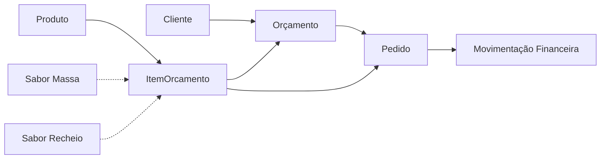

# Modelos de Dados - Sistema de Gestão para Confeitaria

## 📋 Visão Geral

Este documento descreve todos os modelos de dados utilizados no sistema. Todas as interfaces são definidas em `lib/storage.ts`.

## 🏷️ Entidades Principais

### **1. Produto**

Representa um produto (bolo, adicional ou serviço) oferecido pela confeitaria.

```typescript
interface Produto {
    id: string;                              // UUID único
    nome: string;                            // Nome do produto
    categoria: 'Bolo' | 'Adicional' | 'Serviço';
    preco: number;                           // Preço base
    precosPorTamanho?: Record<string, number>; // Preços específicos (P/M/G)
    descricao?: string;                      // Descrição opcional
    foto?: string;                           // URL ou base64 da foto
    tamanhos?: string[];                     // Ex: ['P', 'M', 'G']
    tempoProducao?: number;                  // Horas necessárias
    ativo: boolean;                          // Produto ativoproduto inativo
}
```

**Exemplo:**
```json
{
    "id": "550e8400-e29b-41d4-a716-446655440000",
    "nome": "Bolo de Chocolate",
    "categoria": "Bolo",
    "preco": 70.00,
    "precosPorTamanho": {
        "P": 50.00,
        "M": 70.00,
        "G": 90.00
    },
    "tamanhos": ["P", "M", "G"],
    "tempoProducao": 3,
    "ativo": true
}
```

---

### **2. Cliente**

Representa um cliente da confeitaria.

```typescript
interface Cliente {
    id: string;
    nome: string;
    cpf: string;                             // CPF (opcional desde atualização)
    telefone: string;
    email?: string;
    endereco: {
        cep?: string;
        rua?: string;
        numero?: string;
        complemento?: string;
        bairro?: string;
        cidade?: string;
        estado?: string;
    };
    observacoes?: string;
}
```

---

### **3. Orçamento**

Representa um orçamento criado para um cliente.

```typescript
interface Orcamento {
    id: string;
    numero: number;                          // Número sequencial
    cliente: Cliente;
    dataCriacao: string;                     // ISO 8601
    validade: string;                        // Data de validade
    status: 'Pendente' | 'Enviado' | 'Aprovado' | 'Recusado' | 'Expirado';
    itens: ItemOrcamento[];
    entrega: {
        data: string;
        horario: string;
        tipo: 'Entrega' | 'Retirada';
        endereco?: Endereco;
        taxa?: number;
        distancia?: number;
        instrucoesRetirada?: string;
    };
    decoracao: {
        descricao: string;
        imagens: string[];                   // URLs ou base64
        observacoes?: string;
    };
    valorTotal: number;
    observacoes?: string;
    atualizadoEm: string;
}
```

**ItemOrcamento:**
```typescript
interface ItemOrcamento {
    id: string;
    produtoId: string;
    nome: string;
    tamanho?: string;
    saborMassa?: string;
    saborRecheio?: string;                   // Pode conter múltiplos (separados por " + ")
    quantidade: number;
    precoUnitario: number;
    subtotal: number;
}
```

---

### **4. Pedido**

Representa um pedido de produção (pode ser gerado a partir de um orçamento aprovado).

```typescript
interface Pedido {
    id: string;
    numero: number;
    orcamentoId?: string;                    // Referência ao orçamento original
    cliente: Cliente;
    dataCriacao: string;
    dataEntrega: string;
    horaEntrega: string;
    tipo: 'Entrega' | 'Retirada';
    itens: ItemOrcamento[];
    decoracao: {
        descricao: string;
        imagensReferencia: string[];
        observacoes?: string;
    };
    entrega: {
        tipo: 'Entrega' | 'Retirada';
        endereco?: Endereco;
        taxaEntrega?: number;
        distancia?: number;
        instrucoes?: string;
    };
    producao: {
        checklist: ChecklistItem[];
        fotos: string[];
    };
    financeiro: {
        valorTotal: number;
        valorPago: number;
        saldoPendente: number;
        formaPagamento: 'PIX' | 'Dinheiro' | 'Cartão Débito' | 'Cartão Crédito';
        statusPagamento: 'Pendente' | 'Parcial' | 'Pago';
    };
    status: 'Pagamento Pendente' | 'Aguardando Produção' | 'Em Produção' | 
            'Pronto' | 'Saiu para Entrega' | 'Entregue' | 'Cancelado';
    prioridade: 'Normal' | 'Urgente';
    historico: HistoricoItem[];
    atualizadoEm: string;
}
```

**Subtipos:**
```typescript
interface ChecklistItem {
    id: string;
    descricao: string;
    concluido: boolean;
}

interface HistoricoItem {
    data: string;
    acao: string;
    usuario: string;
}
```

---

### **5. Insumo (Estoque)**

Representa um insumo/ingrediente em estoque.

```typescript
interface Insumo {
    id: string;
    nome: string;
    categoria: 'Ingrediente' | 'Embalagem' | 'Decoração' | 'Outros';
    quantidade: number;
    unidade: string;                         // kg, L, un, etc.
    estoqueMinimo: number;
    fornecedor?: string;
    custoUnitario: number;
    ultimaCompra?: string;                   // Data ISO 8601
    observacoes?: string;
}
```

---

### **6. Movimentação Financeira**

Representa uma entrada ou saída financeira.

```typescript
interface MovimentacaoFinanceira {
    id: string;
    data: string;
    tipo: 'Entrada' | 'Saída';
    categoria: string;
    descricao: string;
    valor: number;
    formaPagamento: 'PIX' | 'Dinheiro' | 'Cartão Débito' | 'Cartão Crédito' | 'Transferência';
    pedidoId?: string;                       // Referência ao pedido (se aplicável)
    comprovante?: string;                    // URL ou base64
    observacoes?: string;
}
```

---

### **7. Sabor (Massa/Recheio)**

Representa sabores disponíveis para massas e recheios.

```typescript
interface Sabor {
    id: string;
    nome: string;
    tipo: 'Massa' | 'Recheio';
    ativo: boolean;
}
```

---

## 🔗 Relacionamentos



**Chave:**
- Linha sólida: Relacionamento direto
- Linha pontilhada: Relacionamento opcional/indireto

---

## 💾 Armazenamento

Todos os dados são armazenados no **LocalStorage** com as seguintes chaves:

```typescript
{
    "produtos": Produto[],
    "clientes": Cliente[],
    "orcamentos": Orcamento[],
    "pedidos": Pedido[],
    "insumos": Insumo[],
    "movimentacoes": MovimentacaoFinanceira[],
    "saboresMassa": Sabor[],
    "saboresRecheio": Sabor[]
}
```

**Exemplo de Acesso:**
```typescript
// Leitura
const produtos = storage.getProdutos();

// Escrita
storage.saveProduto(novoProduto);

// Exclusão
storage.deleteProduto(id);
```

---

## 🔄 Migrações de Dados

### **Versão 1.0 → 1.1 (Preços por Tamanho)**

Foi adicionado o campo `precosPorTamanho` à interface `Produto`:

```typescript
// Antes
interface Produto {
    preco: number;
}

// Depois
interface Produto {
    preco: number;                           // Mantido para compatibilidade
    precosPorTamanho?: Record<string, number>; // NOVO
}
```

**Comportamento:**
- Se `precosPorTamanho` estiver definido, usa o preço específico do tamanho
- Caso contrário, usa o `preco` base

---

## 📊 Validações

### **Regras de Negócio:**

1. **CPF:** Agora opcional (atualização recente)
2. **Telefone:** Obrigatório
3. **Preço:** Deve ser > 0
4. **Quantidade:** Deve ser >= 1
5. **Data de Entrega:** Não pode ser no passado
6. **Status de Pedido:** Segue fluxo específico (não permite pulos arbitrários)

---

## 🔗 Links Relacionados

- [API e Storage](./API_STORAGE.md)
- [Componentes](./COMPONENTES.md)
- [Arquitetura](./README.md)
