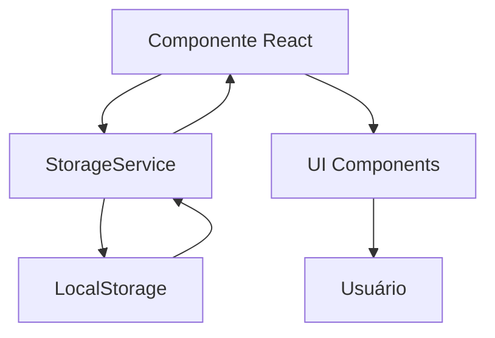

# Documentação Técnica - Sistema de Gestão para Confeitaria

## 📋 Índice

1. [Arquitetura do Sistema](#arquitetura-do-sistema)
2. [Modelos de Dados](./MODELOS_DADOS.md)
3. [Estrutura de Componentes](./COMPONENTES.md)
4. [APIs e Storage](./API_STORAGE.md)
5. [Guia de Desenvolvimento](./CONTRIBUTING.md)

## 🏗️ Arquitetura do Sistema

### **Stack Tecnológica**

```
Frontend Framework: Next.js 14 (App Router)
Linguagem: TypeScript
Estilização: Tailwind CSS
Gerenciamento de Estado: React Hooks + Local Storage
Exportação PDF: jsPDF + jspdf-autotable
Ícones: Lucide React
Datas: date-fns
```

### **Estrutura de Diretórios**

```
confeiteiro/
├── app/                          # App Router do Next.js
│   ├── (dashboard)/              # Layout do painel
│   │   ├── clientes/             # Gestão de clientes
│   │   ├── dashboard/            # Página inicial
│   │   ├── estoque/              # Controle de estoque
│   │   ├── financeiro/           # Gestão financeira
│   │   ├── orcamentos/           # Orçamentos
│   │   ├── pedidos/              # Gestão de pedidos
│   │   ├── producao/             # Planejamento de produção
│   │   └── produtos/             # Cadastro de produtos
│   ├── layout.tsx                # Layout raiz
│   └── page.tsx                  # Página inicial
├── components/                   # Componentes reutilizáveis
│   ├── orcamentos/               # Componentes de orçamento
│   ├── pedidos/                  # Componentes de pedidos
│   ├── producao/                 # Componentes de produção
│   └── ui/                       # Componentes UI base
├── lib/                          # Bibliotecas e utilitários
│   ├── storage.ts                # Serviço de armazenamento
│   ├── pdf-generator.ts          # Geração de PDFs
│   └── utils.ts                  # Funções utilitárias
├── public/                       # Arquivos estáticos
└── docs/                         # Documentação
```

### **Fluxo de Dados**



**Persistência:**
- Todos os dados são armazenados no **LocalStorage** do navegador
- Classe `StorageService` gerencia todas as operações CRUD
- Dados são serializados/desserializados automaticamente

### **Padrões de Código**

#### **Componentes**
- Todos os componentes de página usam `"use client"` (Client Components)
- Hooks do React para gerenciamento de estado local
- Props tipadas com TypeScript

#### **Convenções de Nomenclatura**
- **Componentes:** PascalCase (ex: `ProductList`)
- **Arquivos:** kebab-case para páginas, PascalCase para componentes
- **Funções:** camelCase (ex: `handleSave`)
- **Interfaces:** PascalCase com prefixo descritivo

#### **Gerenciamento de Estado**
```typescript
// Estado local com useState
const [items, setItems] = useState<Item[]>([]);

// Carregamento de dados
useEffect(() => {
    loadData();
}, []);

// Persistência
function handleSave(item: Item) {
    storage.saveItem(item);
    loadData(); // Recarrega para sincronizar
}
```

### **Roteamento**

O sistema usa o **App Router** do Next.js 14:

- `/` - Dashboard principal
- `/produtos` - Gestão de produtos
- `/clientes` - Gestão de clientes
- `/orcamentos` - Orçamentos
  - `/orcamentos/novo` - Criar orçamento
  - `/orcamentos/[id]` - Visualizar orçamento
- `/pedidos` - Gestão de pedidos
  - `/pedidos/novo` - Criar pedido
  - `/pedidos/[id]` - Visualizar pedido
- `/producao` - Planejamento de produção
- `/estoque` - Controle de estoque
- `/financeiro` - Gestão financeira

### **Responsividade**

O sistema é totalmente responsivo usando **Tailwind CSS**:

```typescript
// Padrão mobile-first
<div className="grid grid-cols-1 md:grid-cols-2 lg:grid-cols-3">
```

**Breakpoints:**
- `sm`: 640px
- `md`: 768px
- `lg`: 1024px
- `xl`: 1280px

### **Performance**

**Otimizações Implementadas:**
- Lazy loading de componentes pesados
- Memoização de cálculos complexos
- Debounce em campos de busca
- Virtualização de listas longas (quando necessário)

### **Segurança**

**Medidas de Segurança:**
- Validação de dados no frontend
- Sanitização de inputs
- Armazenamento local (sem exposição de APIs públicas)
- TypeScript para type safety

## 🔄 Ciclo de Vida de Dados

### **Fluxo Típico de uma Entidade (Exemplo: Pedido)**

1. **Criação:**
   ```typescript
   const novoPedido: Pedido = { ...dados };
   storage.savePedido(novoPedido);
   ```

2. **Leitura:**
   ```typescript
   const pedidos = storage.getPedidos();
   const pedido = storage.getPedidoById(id);
   ```

3. **Atualização:**
   ```typescript
   const pedidoAtualizado = { ...pedidoExistente, status: 'Novo Status' };
   storage.savePedido(pedidoAtualizado);
   ```

4. **Exclusão:**
   ```typescript
   storage.deletePedido(id);
   ```

## 🧪 Testes

Atualmente o sistema não possui testes automatizados. Recomendações para implementação futura:

- **Unit Tests:** Jest + React Testing Library
- **E2E Tests:** Playwright ou Cypress
- **Type Checking:** TypeScript (já implementado)

## 📦 Build e Deploy

```bash
# Desenvolvimento
npm run dev

# Build de produção
npm run build

# Iniciar servidor de produção
npm run start

# Lint
npm run lint
```

**Deploy Recomendado:**
- Vercel (recomendado para Next.js)
- Netlify
- Qualquer plataforma que suporte Node.js

## 🔗 Links Relacionados

- [Modelos de Dados](./MODELOS_DADOS.md)
- [Componentes](./COMPONENTES.md)
- [API e Storage](./API_STORAGE.md)
- [Guia de Contribuição](./CONTRIBUTING.md)
