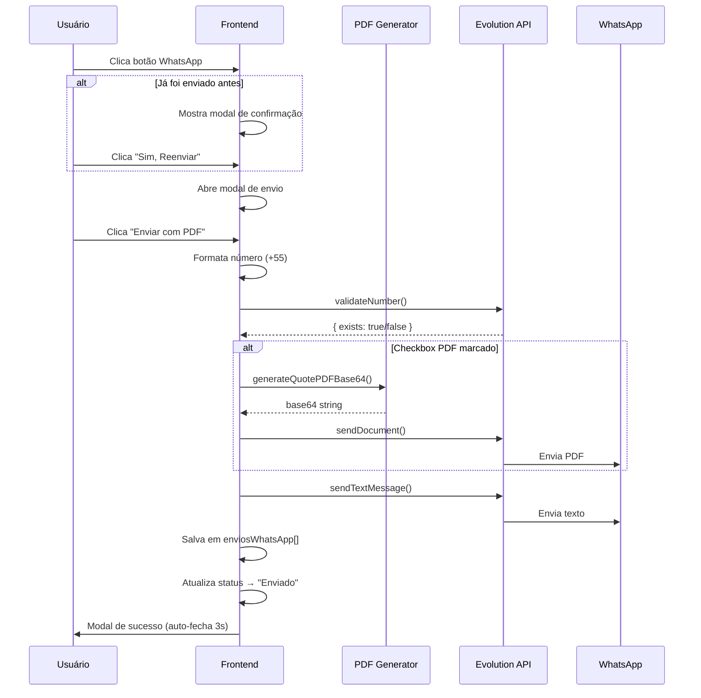

# Integração WhatsApp (Evolution API v2) - Documentação Técnica

Este documento detalha a implementação técnica do módulo de WhatsApp no sistema Confeiteiro, focado no envio de mensagens transacionais (orçamentos com PDF anexo) utilizando a Evolution API v2.

---

## 1. Visão Geral

O módulo permite enviar orçamentos diretamente para clientes via WhatsApp, incluindo:
- Mensagem de texto personalizada
- PDF do orçamento como anexo
- Histórico completo de envios
- Confirmação visual antes de reenviar

**Stack Tecnológica:**
- **Frontend:** Next.js 15 (App Router)
- **API Client:** `lib/evolution-api.ts`
- **PDF Generator:** `lib/pdf-generator.ts` (jsPDF + jspdf-autotable)
- **Storage:** `lib/storage.ts` (localStorage)
- **Gateway:** Evolution API v2

---

## 2. Estrutura de Arquivos

| Arquivo | Descrição |
|---------|-----------|
| `lib/evolution-api.ts` | Singleton service para comunicação com Evolution API |
| `lib/pdf-generator.ts` | Funções de geração de PDF (incluindo base64) |
| `lib/storage.ts` | Interface Orcamento com campo `enviosWhatsApp` |
| `components/settings/WhatsAppSettings.tsx` | Componente de gestão de instâncias |
| `app/(dashboard)/orcamentos/page.tsx` | Lista de orçamentos com envio rápido |
| `app/(dashboard)/orcamentos/[id]/OrcamentoDetalhesClient.tsx` | Detalhes com envio WhatsApp |

---

## 3. Configuração

### Variáveis de Ambiente
```env
NEXT_PUBLIC_EVOLUTION_API_URL=https://apiwp.automacaototal.com
NEXT_PUBLIC_EVOLUTION_API_KEY=sua_api_key_aqui
```

### Armazenamento Local (localStorage)
```javascript
// Chave: 'evolution_config'
{
  apiUrl: string,
  apiKey: string,
  instanceName: string  // Nome da instância criada pelo usuário
}
```

> ⚠️ **IMPORTANTE:** O `instanceName` é único por cliente/confeitaria. A API é compartilhada, então cada cliente deve criar sua própria instância.

---

## 4. Evolution API v2 - Formatos de Requisição

### 4.1 Enviar Mensagem de Texto
```http
POST /message/sendText/{instanceName}
Content-Type: application/json

{
  "number": "5551999999999",
  "text": "Sua mensagem aqui"
}
```

### 4.2 Enviar Documento (PDF)
```http
POST /message/sendMedia/{instanceName}
Content-Type: application/json

{
  "number": "5551999999999",
  "mediatype": "document",
  "media": "JVBERi0xLjQKJe...",  // Base64 SEM prefixo data:
  "fileName": "Orcamento-12345.pdf",
  "caption": "📄 Orçamento #12345"
}
```

### 4.3 Validar Número WhatsApp
```http
POST /chat/whatsappNumbers/{instanceName}
Content-Type: application/json

{
  "numbers": ["5551999999999"]
}
```
**Resposta:**
```json
[{ "exists": true, "jid": "5551999999999@s.whatsapp.net" }]
```

---

## 5. Formato de Número de Telefone

### ⚠️ CRÍTICO: Código do País é Obrigatório

A Evolution API requer números no formato internacional completo:

```
55 + DDD + NÚMERO
```

**Exemplos:**
| Formato Original | Formato Correto | Resultado |
|-----------------|-----------------|-----------|
| `51994731234` | `5551994731234` | ✅ Funciona |
| `(51) 99473-1234` | `5551994731234` | ✅ Funciona |
| `999731234` | `55XX999731234` | ❌ Precisa DDD |

### Código de Formatação Automática
```typescript
// Implementado em openWhatsAppModal()
let phone = orcamento.cliente.telefone.replace(/\D/g, '');
if (!phone.startsWith('55')) {
    phone = '55' + phone;
}
```

> 📝 **Nota:** Se o cliente cadastrar o telefone sem DDD, o envio ainda pode falhar. Recomenda-se validar o telefone no cadastro de clientes.

---

## 6. Geração de PDF Base64

A função `generateQuotePDFBase64` em `lib/pdf-generator.ts` gera o PDF em memória e retorna como base64:

```typescript
export function generateQuotePDFBase64(orcamento: Orcamento): string {
    const doc = new jsPDF();
    // ... configuração do PDF ...
    
    // Retorna base64 SEM o prefixo "data:application/pdf;base64,"
    const base64Full = doc.output('datauristring');
    const base64Clean = base64Full.split(',')[1];
    return base64Clean;
}
```

---

## 7. Fluxo de Envio de Orçamento



---

## 8. Histórico de Envios WhatsApp

### Estrutura de Dados
```typescript
// Em lib/storage.ts - Interface Orcamento
interface Orcamento {
    // ... outros campos ...
    enviosWhatsApp?: Array<{
        numero: number;       // Número sequencial do envio (1, 2, 3...)
        data: string;         // ISO date string
        tipo: 'PDF' | 'Texto' | 'PDF+Texto';
        telefone: string;     // Número do destinatário
    }>;
}
```

### Uso no Sistema
- **Confirmação de Reenvio:** Se `enviosWhatsApp.length > 0`, mostra modal com detalhes do último envio
- **Histórico Visual:** Pode ser exibido na aba "Histórico" do orçamento
- **Relatórios:** Permite rastrear quantas vezes cada orçamento foi enviado

---

## 9. Gestão de Instâncias (Multi-Tenant)

### Criação de Instância
1. Usuário acessa **Configurações > WhatsApp**
2. Clica em **"+ Nova Instância"**
3. Informa um nome único (ex: "minha-confeitaria")
4. Sistema salva `instanceName` no localStorage

### Regras de Segurança
- **Nunca buscar todas as instâncias** da API (são compartilhadas)
- Sempre filtrar pela instância salva localmente
- Se instância não existir (404), limpar config para criar nova

```typescript
// ❌ ERRADO - expõe instâncias de outros clientes
const allInstances = await evolutionAPI.fetchInstances();

// ✅ CORRETO - busca apenas a instância do cliente
const myInstance = await evolutionAPI.fetchInstances(config.instanceName);
```

---

## 10. Troubleshooting - Guia de Resolução de Problemas

### 10.1 Mensagem/PDF não envia (nada acontece)

**Sintomas:** Clica no botão, loading aparece, mas nada é enviado.

**Diagnóstico:** Abra o DevTools (F12) > Console e procure por logs `[SendWhatsApp]`.

| Log | Problema | Solução |
|-----|----------|---------|
| Nenhum log aparece | Função não está sendo chamada | Verificar se o modal está abrindo corretamente |
| `No selected orcamento` | Estado não foi setado | Verificar `setSelectedOrcamentoForWhatsapp` |
| `Config: {instanceName: undefined}` | WhatsApp não configurado | Ir em Configurações > WhatsApp |

### 10.2 Erro 400 - Bad Request

**Sintomas:** Console mostra `EvolutionAPIError: 400 - Bad Request`

**Causas Comuns:**

| Resposta da API | Causa | Solução |
|-----------------|-------|---------|
| `exists: false` | Número sem código do país | Verificar formatação (+55) |
| `requires property "text"` | Formato API v1 em v2 | Usar `text` no nível raiz |
| `requires property "mediatype"` | Formato incorreto | Usar `mediatype` no nível raiz |
| `Owned media must be base64` | Prefixo data: no base64 | Remover `data:application/pdf;base64,` |

### 10.3 Erro 404 - Instance Not Found

**Sintomas:** `Instance "X" not found`

**Causa:** O `instanceName` salvo localmente não existe mais na API.

**Solução:**
1. Ir em Configurações > WhatsApp
2. Criar uma nova instância
3. Escanear QR Code

### 10.4 Número não existe no WhatsApp

**Sintomas:** `Validation result: {exists: false}`

**Causas:**
1. Número incorreto (falta dígito 9)
2. Número sem código do país (55)
3. Número realmente não tem WhatsApp

**Solução:** O sistema prossegue mesmo assim, mas a mensagem não será entregue.

### 10.5 Modal de confirmação não aparece

**Sintomas:** Clica no botão WhatsApp e nada acontece (para orçamentos já enviados).

**Causa (histórica):** O `window.confirm()` não era exibido em alguns navegadores.

**Solução aplicada:** Substituído por modal customizado (`resendConfirmModal`).

---

## 11. Debug - Logs do Console

O sistema inclui logs para facilitar debug:

```javascript
[WhatsApp] handleSendClick called for: 25338
[WhatsApp] previousSends: 1
[WhatsApp] Formatted phone: 5551994731234
[SendWhatsApp] Starting...
[SendWhatsApp] Config: {instanceName: "conveitaria_2", hasApiKey: true}
[SendWhatsApp] Validating number: 5551994731234
[SendWhatsApp] Validation result: {exists: true, jid: "5551994731234@s.whatsapp.net"}
[SendWhatsApp] Generating PDF...
[SendWhatsApp] PDF generated, length: 13020
[SendWhatsApp] Sending PDF document...
[SendWhatsApp] PDF sent successfully
[SendWhatsApp] Sending text message...
[SendWhatsApp] Text message response: {status: "PENDING", ...}
```

### Como Usar os Logs
1. Abra DevTools (F12) > Console
2. Tente enviar uma mensagem
3. Copie os logs `[SendWhatsApp]` e `[WhatsApp]`
4. Identifique onde o fluxo parou

---

## 12. Código de Referência

### sendTextMessage (Evolution API v2)
```typescript
async sendTextMessage(instanceName: string, number: string, text: string) {
    const cleanNumber = number.replace(/\D/g, '');
    return this.request(`/message/sendText/${instanceName}`, {
        method: 'POST',
        body: JSON.stringify({
            number: cleanNumber,
            text: text  // ← v2: texto no nível raiz
        }),
    });
}
```

### sendDocument (Evolution API v2)
```typescript
async sendDocument(instanceName: string, number: string, base64File: string, fileName: string, caption?: string) {
    const cleanNumber = number.replace(/\D/g, '');
    return this.request(`/message/sendMedia/${instanceName}`, {
        method: 'POST',
        body: JSON.stringify({
            number: cleanNumber,
            mediatype: 'document',  // ← v2: mediatype no nível raiz
            mimetype: 'application/pdf',
            media: base64File,      // ← base64 SEM prefixo
            fileName: fileName,
            caption: caption || ''
        }),
    });
}
```

### Formatação de Telefone
```typescript
function openWhatsAppModal(orcamento: Orcamento) {
    let phone = orcamento.cliente.telefone.replace(/\D/g, '');
    if (!phone.startsWith('55')) {
        phone = '55' + phone;
    }
    setWhatsappData({ phone, message: '...' });
}
```

---

## 13. Histórico de Alterações

| Data | Alteração |
|------|-----------|
| 29/12/2024 | ✅ Implementação do envio de PDF como anexo |
| 29/12/2024 | ✅ Correção do formato Evolution API v2 (text/mediatype no root) |
| 29/12/2024 | ✅ Correção de segurança multi-tenant (não buscar todas instâncias) |
| 29/12/2024 | ✅ Auto-limpeza de instanceName quando instância não existe (404) |
| 29/12/2024 | ✅ Modal customizado para confirmação de reenvio (substituiu window.confirm) |
| 29/12/2024 | ✅ Formatação automática de telefone com código do país (+55) |
| 29/12/2024 | ✅ Histórico de envios WhatsApp (enviosWhatsApp[]) |
| 29/12/2024 | ✅ Auto-close do modal de sucesso após 3 segundos |
| 29/12/2024 | ✅ Logs de debug detalhados no console |

---

## 14. Próximos Passos (Futuros)

- [ ] Armazenar PDF no Supabase/Firebase em vez de gerar dinamicamente
- [ ] Webhook para receber status de entrega da mensagem
- [ ] Agendamento de envio de orçamentos
- [ ] Templates de mensagem configuráveis
- [ ] Validação de telefone (DDD + 9 dígitos) no cadastro de clientes
- [ ] Exibição visual do histórico de envios na tela de orçamento
